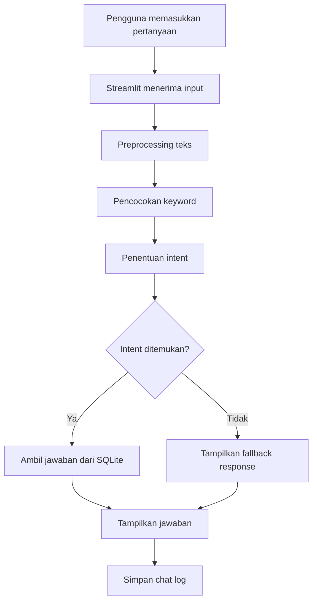

# Employee Helpdesk Chatbot

Employee Helpdesk Chatbot adalah aplikasi simulasi chatbot internal perusahaan
untuk membantu menjawab pertanyaan umum karyawan. Jawaban diperoleh dari data
FAQ yang tersimpan dalam database SQLite.

Aplikasi dikembangkan menggunakan Python dan Streamlit dengan pendekatan
pencocokan kata kunci untuk mendeteksi intent pertanyaan.

> Seluruh data dan kebijakan dalam proyek ini bersifat fiktif dan hanya
> digunakan untuk pembelajaran serta portofolio.

## Demo Aplikasi

Tautan aplikasi Streamlit akan ditambahkan setelah proses deployment selesai.

## Fitur Utama

- Menjawab pertanyaan umum karyawan
- Mendeteksi intent berdasarkan kata kunci
- Mengambil jawaban dari database SQLite
- Menyediakan fallback untuk pertanyaan yang tidak dikenali
- Menampilkan riwayat percakapan selama sesi berlangsung
- Menyimpan chat log ke database
- Menyediakan tombol untuk menghapus percakapan
- Menyediakan pengujian otomatis untuk deteksi intent

## Topik yang Tersedia

Chatbot dapat memberikan informasi simulasi mengenai:

- Pengajuan cuti
- Prosedur lembur
- Kendala absensi
- Informasi penggajian
- Jadwal shift
- Keselamatan dan Kesehatan Kerja (K3)

## Teknologi yang Digunakan

- Python
- Streamlit
- SQLite
- Regular Expression
- Git dan GitHub
- Streamlit Community Cloud

## Alur Kerja Sistem



Proses chatbot:

1. Pengguna memasukkan pertanyaan melalui aplikasi Streamlit.
2. Sistem mengubah teks menjadi huruf kecil.
3. Sistem menghapus tanda baca dan spasi berlebih.
4. Pertanyaan dibandingkan dengan keyword pada database.
5. Intent dengan skor kecocokan tertinggi dipilih.
6. Jawaban yang sesuai diambil dari SQLite.
7. Jika tidak ada kecocokan, chatbot memberikan fallback response.
8. Pertanyaan dan jawaban disimpan pada tabel riwayat percakapan.

## Struktur Proyek

```text
employee-helpdesk-chatbot/
├── app.py
├── chatbot.py
├── database.py
├── employee_chatbot.db
├── requirements.txt
├── setup_database.py
├── tests/
│   └── test_chatbot.py
├── docs/
│   ├── technical-documentation.md
│   └── user-manual.md
├── .gitignore
└── README.md
```

## Penjelasan File

| File | Fungsi |
|---|---|
| `app.py` | Mengatur antarmuka aplikasi Streamlit |
| `chatbot.py` | Menangani preprocessing, deteksi intent, dan respons |
| `database.py` | Menangani koneksi dan operasi database |
| `setup_database.py` | Membuat tabel dan memasukkan data FAQ |
|| `employee_chatbot.db` | Men Menyimpan FAQ dan chat log |
| `test_chatbot.py` | Menguji ketepatan deteksi intent |
| `technical-documentation.md` | Menjelaskan aspek teknis sistem |
| `user-manual.md` | Memberikan panduan penggunaan aplikasi |
 |
| `requirements.txt` | Menyimpan daftar library yang diperlukan diperlukan |

## Struktur Database

Database memiliki dua tabel.

### Tabel `faqfaq`

| Kolom | | Keterangan |
|---|---|
| `id` | ID unik FAQ |
| `intent` | Kategori pertanyaan |
| `keywords` | Daftar kata kunci |
| `answer`` | Jawaban chatbot |

### Tabel `chat_logs`

| Kolom | Keterangan |
|---|---|
| ` `id` | ID unik percakapan |
|| `user_message` | Pertanyaan pengguna |
| `detected_intent` | Intent yang terdeteksi |
| `bot_response` | Jawaban chatbot |
| `created_at` | Waktu percakapan |

## Contoh Pertanyaan

```text
Bagaimana cara mengajukan cuti?
Bagaimana prosedur lembur?
Saya lupa melakukan absen.
Di mana saya dapat melihat slip gaji?
Bagaimana cara melihat jadwal shift?
Bagaimana melaporkan kecelakaan kerja?
```

Contoh hasil:

```text
Pertanyaan : Bagaimana cara mengajukan cuti?
Intent     : pengajuan_cuti
Jawaban    : Pengajuan cuti dilakukan melalui sistem HR dan harus
             memperoleh persetujuan atasan.
```

## Menjalankan Proyek Secara Lokal

### 1. Clone repository

```bash
git clone https https://github.com/USERNAME/employee-helpdesk-chatbot.git
cd employee-helpdesk-chatbot
```

Ganti `USERNAME` dengan username GitHub pemilik repository.

### 2. Instal library

```bash
pip install -r requirements.txt
```

### 3. Siapkan database

```bash
python setup_database.py
```

### 4. Jalankan aplikasi

```bash
streamlit run run app.py
```

Aplikasi akan terbuka melalui browser.

## Menjalankan Pengujian

```bashbash
python tests/test_chatbot.py
```

Pengujian dilakukan menggunakan 13 variasii pertanyaan. Pada data uji yang
tersedia, seluruh intent berhasil diprediksi sesuai hasil yang diharapkan.

```text
Jumlah pengujian : 13
Prediksi benar   : 13
Prediksi salah   : 0
Akurasi pengujian: 100.00%
```

Hasil tersebut hanya menunjukkan performa pada data uji yang tersedia dan tidak
mewakakili seluruh kemungkinan pertanyaan pengguna.

## Dokumentasi

Dokumentasi lebih lengkap tersedia pada:

- [Dokumentasi Teknis](docs/technical-documentation.md)
- [User Manual](docs/user-manual.md.md)

## Batasan Sistem

- Chatbot masih menggunakan pencocokan kata kata kunci.
- Chatbot belum menggunakan model NLP atau AI generatif.
- Jawaban terbatas pada data FAQ yang tersedia.
- Variasi pertanyaan tanpa keyword yang sesuai dapat gagal dikenali.
- Aplikasi belum memiliki autentikasi pengguna.
- Chatbot belum terhubung dengan sistem perusahaan sebenarnya.
- Penyimpanan chat log di Streamlit Community Cloud tidak bersifat permanen.

## Rencana Pengembangan

- Menambahkan lebih banyak intent dan variasi pertanyaan
- Mengimplementasikan pencocokan semantik
- Mengembangkan klasifikasi intent menggunakan NLP
- Menghubungkan chatbot dengan dokumen SOP
- Mengembangkan chatbot berbasis RAG
- Menambahkan autentikasi dan pembatasan akses
- Menggunakan database online untuk penyimpanan permanen
- Mengintegrasikan chatbot dengan HRIS atau aplikasi internal

## Catatan

Proyek ini dikembangkan sebagai simulasi untuk mempelajari alur pengembangan
chatbot, integrasi database, testing, debugging, dokumentasi perangkat lunak,
dan deployment aplikasi.
